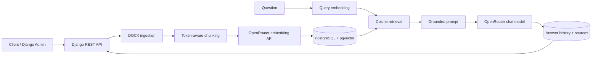

# RoshanAI-Interview Project

This is a Django-based API for grounded question answering over Farsi DOCX files. An uploaded document is validated, extracted, split into token-aware chunks, embedded, and indexed in PostgreSQL with pgvector. When a question is submitted, the most relevant chunks are retrieved and a language model generates an answer using only that context.

This repository is a demonstration project. The documents under `samples/` contain fictional data created specifically for the demo.

## Features

- DOCX upload and validation
- Full extracted-text persistence
- Farsi-aware, token-based chunking
- Embedding generation through OpenRouter
- Vector search with PostgreSQL and pgvector
- Optional retrieval filtering with `document_ids`
- RAG answers with source excerpts and similarity scores
- Persistent question, answer, model, source, and latency history
- Document and QA management through Django Admin
- OpenAPI schema and Swagger UI
- Tests that do not depend on external AI services

## Architecture



Ingestion and question answering are synchronous in the current version. The application stores 2,048-dimensional embeddings in a pgvector `HalfVectorField` and performs cosine-distance search using an HNSW index.

## Technology stack

- Python 3.13 and Django 5.2
- Django REST Framework
- PostgreSQL 17 and pgvector
- LangChain Core and LangChain OpenRouter
- Hugging Face Tokenizers
- drf-spectacular
- Docker Compose

Exact Python dependency versions are pinned in [`requirements.txt`](requirements.txt).

## Prerequisites

- Git
- Docker Desktop, or Docker Engine with Compose v2
- Internet access for OpenRouter and the initial Hugging Face tokenizer download
- An [OpenRouter API key](https://openrouter.ai/keys)

Python and Conda are not required on the host for the standard setup. All runtime dependencies are installed inside the Docker image.

## Setup from scratch

### 1. Clone the repository

```bash
git clone https://github.com/roozman/roshanai-interview.git
cd roshanai-interview
```

### 2. Create the environment file

PowerShell:

```powershell
Copy-Item .env.example .env
```

Linux/macOS:

```bash
cp .env.example .env
```

At minimum, replace the following values in `.env`:

```dotenv
DJANGO_SECRET_KEY=<a-long-random-secret>
POSTGRES_PASSWORD=<a-strong-database-password>
OPENROUTER_API_KEY=<your-openrouter-api-key>
```

Generate the secret with a password manager. If Python is already available on the host, its standard library can also generate one:

```bash
python -c "import secrets; print(secrets.token_urlsafe(50))"
```

The `.env` file contains secrets and must never be committed. Safe defaults and the full variable list are provided in [`.env.example`](.env.example).

### 3. Validate the Compose configuration

```bash
docker compose config
```

This catches YAML errors, missing substitutions, and invalid Compose configuration before the image is built.

### 4. Build and start the services

```bash
docker compose up --build -d
```

The `db` service starts first. After PostgreSQL becomes healthy, the `web` service applies migrations and starts Django's development server on port 8000.

Inspect service status and application logs:

```bash
docker compose ps
docker compose logs -f web
```

Check API and database health at:

```text
http://localhost:8000/health/
```

Expected response:

```json
{
  "status": "healthy",
  "checks": {
    "database": "available"
  }
}
```

### 5. Apply database migrations

Compose applies migrations automatically during startup. The following manual command is safe and idempotent, and is useful for verification or troubleshooting:

```bash
docker compose exec web python manage.py migrate
```

The first migration enables the PostgreSQL `vector` extension.

### 6. Create a superuser

```bash
docker compose exec web python manage.py createsuperuser
```

After entering a username, email address, and password, open Django Admin at:

```text
http://localhost:8000/admin/
```

## Environment variables

| Variable | Example/default | Purpose |
|---|---|---|
| `DJANGO_SECRET_KEY` | Required | Signs security-sensitive Django data |
| `DJANGO_DEBUG` | `True` in `.env.example` | Development mode; must be `False` in production |
| `DJANGO_ALLOWED_HOSTS` | `localhost,127.0.0.1` | Hosts accepted by Django |
| `POSTGRES_DB` | `roshanai` | Database name |
| `POSTGRES_USER` | `roshanai` | Database user |
| `POSTGRES_PASSWORD` | Required | Database password |
| `POSTGRES_HOST` | `db` | Database service name inside Compose |
| `POSTGRES_PORT` | `5432` | PostgreSQL port inside the Compose network |
| `DOCUMENT_MAX_UPLOAD_SIZE_BYTES` | `10485760` | Maximum compressed upload size: 10 MiB |
| `DOCUMENT_MAX_UNCOMPRESSED_SIZE_BYTES` | `52428800` | Maximum uncompressed DOCX content: 50 MiB |
| `DOCUMENT_CHUNK_SIZE_TOKENS` | `800` | Maximum token count per chunk |
| `DOCUMENT_CHUNK_OVERLAP_TOKENS` | `120` | Token overlap between consecutive chunks |
| `OPENROUTER_API_KEY` | Required for ingestion/RAG | OpenRouter credential |
| `OPENROUTER_BASE_URL` | `https://openrouter.ai/api/v1` | OpenRouter API base URL |
| `OPENROUTER_EMBEDDING_MODEL` | `nvidia/nemotron-3-embed-1b:free` | Embedding model for documents and questions |
| `OPENROUTER_EMBEDDING_BATCH_SIZE` | `16` | Number of texts sent in each embedding batch |
| `OPENROUTER_TIMEOUT_SECONDS` | `60` | Embedding request timeout in seconds |
| `RETRIEVAL_TOP_K` | `5` | Maximum number of retrieved sources |
| `RETRIEVAL_SCORE_THRESHOLD` | `0.35` | Minimum accepted similarity score |
| `OPENROUTER_CHAT_MODEL` | `nvidia/nemotron-3-super-120b-a12b:free` | Answer-generation model |
| `OPENROUTER_CHAT_TEMPERATURE` | `0` | Reduces answer randomness |
| `OPENROUTER_CHAT_MAX_TOKENS` | `800` | Maximum generated-answer length |
| `OPENROUTER_CHAT_TIMEOUT_MS` | `60000` | Chat-model timeout in milliseconds |
| `OPENROUTER_CHAT_MAX_RETRIES` | `0` | Automatic chat-model retries |
| `RAG_MAX_CONTEXT_CHARACTERS` | `12000` | Maximum context characters sent to the model |

## Using Django Admin

After signing in to `/admin/`:

1. Create a document under **Documents**.
2. Enter a title, select a DOCX file, and save it.
3. Processing runs synchronously. A successful document has `status=indexed` and an empty `error_message`.
4. Confirm the extracted-text preview and a chunk count greater than zero.
5. Inspect generated chunks and embedding availability under **Document chunks**. These records are read-only in Admin.
6. To process documents again, select them and run the reindex admin action.
7. Review stored answers, sources, errors, and latency in the question-answer history.

The first indexing operation may download the model tokenizer from Hugging Face. It is persisted in the `huggingface_cache` Docker volume.

## Screenshots

Project screenshots are available in [`docs/screenshots/`](docs/screenshots/).

## Sample data

The [`samples/`](samples/) directory contains three Farsi documents:

- A short software-services contract
- A multi-section energy-forecasting report
- A houseplant-care guide on a different topic

Suggested questions, expected answers, and one deliberately unanswerable question are documented in [`samples/demo_questions.md`](samples/demo_questions.md).

## API and authentication

All endpoints except the health check require authentication. The API supports Django Session Authentication and HTTP Basic Authentication.

| Path | Methods | Purpose |
|---|---|---|
| `/health/` | `GET` | Public API and database health check |
| `/api/v1/documents/` | `GET`, `POST` | List and upload documents |
| `/api/v1/documents/{id}/` | `GET`, `PATCH`, `DELETE` | Retrieve, update, or delete a document |
| `/api/v1/questions/` | `GET`, `POST` | List history or ask a question |
| `/api/v1/questions/{id}/` | `GET` | Retrieve a stored answer and its sources |
| `/api/schema/` | `GET` | OpenAPI schema |
| `/api/docs/` | `GET` | Swagger UI |

To use Swagger UI, first sign in to Django Admin in the same browser and then open:

```text
http://localhost:8000/api/docs/
```

### Upload a document

The following commands prompt for the password so it is not stored in terminal history.

PowerShell:

```powershell
curl.exe -u admin -F "title=Sample contract" -F "file=@samples/01-software-services-contract-fa.docx" http://localhost:8000/api/v1/documents/
```

Linux/macOS:

```bash
curl -u admin \
  -F "title=Sample contract" \
  -F "file=@samples/01-software-services-contract-fa.docx" \
  http://localhost:8000/api/v1/documents/
```

The response contains the document `id`. Successful ingestion returns a document with `status` set to `indexed`; otherwise inspect `error_message`.

### Ask a question

Replace `1` with the actual ID returned by the upload request.

PowerShell:

```powershell
curl.exe -u admin -H "Content-Type: application/json" -d '{"question":"شرایط فسخ قرارداد چیست؟","document_ids":[1]}' http://localhost:8000/api/v1/questions/
```

Linux/macOS:

```bash
curl -u admin \
  -H "Content-Type: application/json" \
  -d '{"question":"شرایط فسخ قرارداد چیست؟","document_ids":[1]}' \
  http://localhost:8000/api/v1/questions/
```

When `document_ids` is omitted, retrieval searches all documents whose status is `indexed`. A successful response contains `answer`, `sources`, the selected model, and `latency_ms`.

## Running tests

Run the complete test suite:

```bash
docker compose exec web python manage.py test
```

Run the critical path from DOCX upload to a sourced answer:

```bash
docker compose exec web python manage.py test config.tests.test_critical_path
```

Validate the OpenAPI schema without warnings:

```bash
docker compose exec web python manage.py spectacular --validate --fail-on-warn --file /tmp/schema.yml
```

Tests mock the tokenizer and external AI services, so they do not require OpenRouter quota or network access. To verify this explicitly, run the suite with Hugging Face in offline mode:

```bash
docker compose exec -e HF_HUB_OFFLINE=1 web python manage.py test
```

## Technical decisions

- **Docker-first setup:** The application and database run in a reproducible environment. Conda is not part of the project runtime.
- **PostgreSQL with pgvector:** Relational data, extracted text, history, and embeddings remain in one database.
- **2,048-dimensional HalfVector:** The field matches the configured Nemotron embedding output while using less storage than full-precision vectors.
- **HNSW with cosine distance:** Provides efficient nearest-neighbor retrieval for text embeddings.
- **Token-aware chunking:** Chunk size is calculated with the model's actual tokenizer and Farsi-aware separators. Defaults are 800 tokens with a 120-token overlap.
- **Constrained retrieval:** Only indexed documents and chunks with embeddings are considered. Retrieval applies a score threshold, top-k limit, normalized-content deduplication, and optional `document_ids` filtering.
- **Grounded generation:** The prompt restricts the model to the retrieved context and requires source references. Missing evidence produces a no-evidence response instead of a fabricated answer.
- **Persistent history:** Questions, answers, sources, ranks, similarity scores, excerpts, model names, errors, and latency are stored for review.
- **Synchronous processing:** This keeps the demo traceable and avoids introducing Celery and Redis before they are needed.
- **Mocked external boundaries:** Tests remain fast, deterministic, and independent of external cost, availability, and rate limits.

## Current limitations

- Only valid DOCX files are supported; PDF and TXT ingestion are not implemented.
- Ingestion and answer generation are synchronous, so large requests may take time.
- Embedding and chat inference depend on OpenRouter connectivity, API-key validity, provider availability, and account quota. Free endpoints have no production SLA and may return HTTP `429`; see the current [OpenRouter FAQ](https://openrouter.ai/docs/faq).
- The tokenizer is downloaded from Hugging Face on first use, and no local inference model is included.
- Authentication is limited to Session and Basic Authentication; user registration and JWT are not implemented.
- The Compose setup is intended for development. It runs Django's development server and does not include TLS, a reverse proxy, or production deployment settings.
- Background jobs, streaming, answer caching, conversation memory, hybrid search, and reranking are not implemented.
- Answer quality depends on source-document quality, retrieval configuration, and model availability.

## Future work

1. Move long-running ingestion and generation jobs to Celery and Redis.
2. Add validated PDF and TXT ingestion.
3. Add hybrid search and reranking.
4. Add safe embedding and answer caches with explicit invalidation.
5. Add response streaming and controlled conversation memory.
6. Add production API authentication, rate limiting, and audit logging.
7. Deploy behind a production ASGI/WSGI server, reverse proxy, and HTTPS.
8. Add automated retrieval and answer-quality evaluation against a reference question set.

## Stopping and resetting the environment

Stop services without deleting data:

```bash
docker compose down
```

Remove the PostgreSQL and tokenizer-cache volumes:

```bash
docker compose down -v
```

The second command permanently deletes the development database and tokenizer cache.

## Security notes

- Never commit `.env` or an API key.
- Set `DJANGO_DEBUG=False` and use a random `DJANGO_SECRET_KEY` in production.
- Restrict `DJANGO_ALLOWED_HOSTS` to the deployed hostnames.
- Enable HTTPS redirects, secure cookies, and HSTS only after TLS and the reverse proxy are configured correctly.
- Do not place passwords or API keys in commands, screenshots, logs, or sample files.
